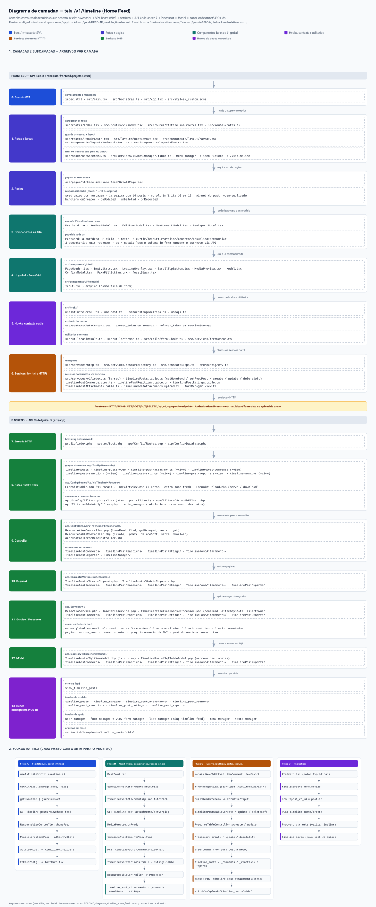

[◄ Índice da base de conhecimento](../README.md)

---

# Módulo Messages / Timeline (API V1)

Domínio **Timeline** do módulo de mensagens: cada usuário tem **uma** timeline
própria (a tabela pai, criada automaticamente na primeira publicação) e publica
posts com texto e anexos. O feed mistura as publicações de todas as timelines e é
visível para qualquer usuário autenticado.

> **Estado (2026-09-27): módulo COMPLETO no backend.** As 7 tabelas e as 7
> views já estão APLICADAS no banco DEV (`codeigniter54900_db`) desde
> 2026-09-26 (script `doc/sql/insert/20260926183935_timeline_tables.sql` +
> §3.1). As classes PHP (Controller/Request/Processor/Model) dos 7 recursos
> foram implementadas e testadas em 2026-09-27 (commit `bcbc808`; as 189 rotas
> testadas uma a uma em `src/writable/claude/timeline_api_testes_resultado.json`,
> todas passando) — **Etapa D backend concluída**. Os 5 `form_manager` e o
> `list_manager` do feed (`timeline-feed`) também foram inseridos em
> 2026-09-27 (`doc/sql/insert/20260927161741_timeline_form_list_menu_seed.sql`)
> — **Etapa C concluída**. **Fase 2 (frontend) concluída em 2026-09-27:**
> listagem clássica do feed em `/v1/timeline-posts`. **Fase 3a (backend)
> concluída em 2026-09-27:** rota extra `home-feed` com o algoritmo do feed
> misto (§5.1). **Fase 3b (frontend) concluída em 2026-09-27:** página
> `/v1/timeline` (Home Feed) — scroll infinito, card único, componente
> global de mídia, botão flutuante de novo post. **Módulo completo** —
> restam só as lacunas conhecidas registradas na §8 (upload de anexo,
> reação/nota "write-only", páginas de detalhe/edição de post).
> Caminho do módulo: [`README_form.md`](README_form.md) — markdown revisado (este
> arquivo) → SQL revisado → aplicação direta no banco DEV. **Sem
> migration** — ver [`README_migrate.md`](README_migrate.md).
>
> Desenhos de formulário do módulo: [`form/timeline/`](form/timeline/) (5
> formulários; reação e estrela não são formulário, são ação).

## 0. Diagrama de camadas

Mapa visual do caminho completo da requisição que constrói a tela `/v1/timeline`
(Home Feed): do boot do SPA até a view `view_timeline_posts`, com as camadas e
subcamadas de frontend e backend, os nomes reais dos arquivos e os quatro fluxos
concretos (feed, card/mídia/comentários, escrita e republicar). O SVG e o
`.drawio` editável ficam em [`../diagramas/`](../diagramas/README.md), junto do
método de geração e do prompt para repetir o padrão.



*O preview reduz a imagem para a largura da janela — [abrir o SVG em tamanho real](../diagramas/README_diagrama_timeline_home_feed.svg).*

## 1. Identidade

| Item               | Valor                                                                                                                                                          |
| ------------------ | -------------------------------------------------------------------------------------------------------------------------------------------------------------- |
| Domínio            | `Messages` / recurso `Timeline`                                                                                                                                |
| Namespace previsto | `Api\V1\Timeline\<Modulo>` (`TimelineManager`, `TimelinePosts`, `TimelinePostComments`, `TimelinePostReactions`, `TimelinePostRatings`, `TimelinePostReports`) |
| Banco / grupo      | `codeigniter54900_db` / conexão `default` (sem `$DBGroup`)                                                                                                     |
| Tabelas            | `timeline_manager`, `timeline_posts`, `timeline_post_attachments`, `timeline_post_comments`, `timeline_post_reactions`, `timeline_post_ratings`, `timeline_post_reports`                    |
| View               | `view_timeline_posts` (feed misturado)                                                                                                                         |
| Anexos             | tabela própria `timeline_post_attachments`, isolada do módulo Upload e do Calendar — **não se mistura com nenhum outro módulo**                                         |
| Padrão             | [`ROADMAP_padrao_modulo.md`](ROADMAP_padrao_modulo.md); espelha `Calendar/CalendarManager` (módulo com view)                                                   |

Escopo deste documento: **Timeline**. O módulo de mensagens pode ganhar outros
recursos depois (mensagem direta, notificação, seguir timeline) — nada disso está
aqui.

## 2. Modelo de dados

### 2.1 `timeline_manager` — a tabela pai (1 por usuário)

Criada pelo Processor na primeira publicação do usuário (não tem tela de
criação). `UNIQUE KEY (user_manager_id)` garante a relação 1:1; `slug` é a
identidade legível (não é chave de busca da API — a chave é o `id`, mesma decisão
do `FormBuild`). `status` nasce `active` porque a timeline é criada no ato da
publicação, não como rascunho.

```sql
CREATE TABLE IF NOT EXISTS `timeline_manager` (
  `id` bigint NOT NULL AUTO_INCREMENT,
  `user_manager_id` bigint NOT NULL,
  `slug` varchar(150) COLLATE utf8mb4_general_ci NOT NULL,
  `title` varchar(255) COLLATE utf8mb4_general_ci NOT NULL,
  `description` text COLLATE utf8mb4_general_ci,
  `cover_image_url` varchar(500) COLLATE utf8mb4_general_ci DEFAULT NULL,
  `status` enum('draft','active','inactive') COLLATE utf8mb4_general_ci NOT NULL DEFAULT 'active',
  `version` int NOT NULL DEFAULT '1',
  `created_at` datetime DEFAULT CURRENT_TIMESTAMP,
  `updated_at` datetime DEFAULT CURRENT_TIMESTAMP ON UPDATE CURRENT_TIMESTAMP,
  `deleted_at` datetime DEFAULT NULL,
  PRIMARY KEY (`id`),
  UNIQUE KEY `user_manager_id` (`user_manager_id`),
  UNIQUE KEY `slug` (`slug`),
  KEY `status` (`status`),
  CONSTRAINT `timeline_manager_user_manager_id_foreign` FOREIGN KEY (`user_manager_id`) REFERENCES `user_manager` (`id`) ON DELETE CASCADE ON UPDATE CASCADE
) ENGINE=InnoDB DEFAULT CHARSET=utf8mb4 COLLATE=utf8mb4_general_ci;
```

### 2.2 `timeline_posts` — a publicação (e a republicação)

`repost_of_id` é o auto-relacionamento da republicação: o post novo pertence à
timeline de quem republicou (`timeline_manager_id` + `user_manager_id` do
reposteador) e aponta para o post original. `user_manager_id` é redundante com o
dono da timeline **de propósito** (o requisito pede o vínculo com a timeline _e_
com o usuário dono); o Processor valida que os dois batem.

`published_at` é preenchido pelo Processor (não é campo do formulário);
`edited_at` marca edição de conteúdo.

```sql
CREATE TABLE IF NOT EXISTS `timeline_posts` (
  `id` bigint NOT NULL AUTO_INCREMENT,
  `timeline_manager_id` bigint NOT NULL,
  `user_manager_id` bigint NOT NULL,
  `repost_of_id` bigint DEFAULT NULL,
  `title` varchar(255) COLLATE utf8mb4_general_ci DEFAULT NULL,
  `content` text COLLATE utf8mb4_general_ci,
  `status` enum('draft','published','hidden','removed') COLLATE utf8mb4_general_ci NOT NULL DEFAULT 'published',
  `published_at` datetime DEFAULT NULL,
  `edited_at` datetime DEFAULT NULL,
  `created_at` datetime DEFAULT CURRENT_TIMESTAMP,
  `updated_at` datetime DEFAULT CURRENT_TIMESTAMP ON UPDATE CURRENT_TIMESTAMP,
  `deleted_at` datetime DEFAULT NULL,
  PRIMARY KEY (`id`),
  KEY `timeline_manager_id` (`timeline_manager_id`),
  KEY `user_manager_id` (`user_manager_id`),
  KEY `repost_of_id` (`repost_of_id`),
  KEY `status_published_at` (`status`,`published_at`),
  CONSTRAINT `timeline_posts_timeline_manager_id_foreign` FOREIGN KEY (`timeline_manager_id`) REFERENCES `timeline_manager` (`id`) ON DELETE CASCADE ON UPDATE CASCADE,
  CONSTRAINT `timeline_posts_user_manager_id_foreign` FOREIGN KEY (`user_manager_id`) REFERENCES `user_manager` (`id`) ON DELETE CASCADE ON UPDATE CASCADE,
  CONSTRAINT `timeline_posts_repost_of_id_foreign` FOREIGN KEY (`repost_of_id`) REFERENCES `timeline_posts` (`id`) ON DELETE SET NULL ON UPDATE CASCADE
) ENGINE=InnoDB DEFAULT CHARSET=utf8mb4 COLLATE=utf8mb4_general_ci;
```

### 2.3 `timeline_post_attachments` — anexo do post

Tabela **própria e isolada** do módulo Timeline (decisão do usuário em
2026-09-26): o anexo de uma publicação **não** se mistura com o módulo Upload nem
com o Calendar. Espelha a estrutura de `calendar_event_attachments` (FK para o
pai com `ON DELETE CASCADE`, `title`, `mime_type`, timestamps, `deleted_at`), mas
carrega as colunas de **arquivo local** que já existem neste banco em `uploads`
(`file_key`, `original_name`, `stored_name`, `storage_path`, `file_url`,
`extension`, `file_size`, `checksum_sha256`, `category`) — porque o arquivo da
Timeline é upload de verdade, não referência externa.

**Não existe coluna `file_id` para `uploads`**: era exatamente o acoplamento
rejeitado. O arquivo físico mora em
`writable/uploads/timeline_posts/<post_id>/` — mesmo padrão de caminho que o
Calendar usa (`writable/uploads/calendar_events/<evento>/`).

```sql
CREATE TABLE IF NOT EXISTS `timeline_post_attachments` (
  `id` bigint NOT NULL AUTO_INCREMENT,
  `timeline_post_id` bigint NOT NULL,
  `file_key` char(32) COLLATE utf8mb4_general_ci NOT NULL,
  `original_name` varchar(255) COLLATE utf8mb4_general_ci NOT NULL,
  `stored_name` varchar(255) COLLATE utf8mb4_general_ci NOT NULL,
  `storage_path` varchar(500) COLLATE utf8mb4_general_ci NOT NULL,
  `file_url` varchar(500) COLLATE utf8mb4_general_ci NOT NULL,
  `mime_type` varchar(150) COLLATE utf8mb4_general_ci DEFAULT NULL,
  `extension` varchar(20) COLLATE utf8mb4_general_ci DEFAULT NULL,
  `file_size` bigint DEFAULT NULL,
  `checksum_sha256` char(64) COLLATE utf8mb4_general_ci DEFAULT NULL,
  `category` enum('image','video','audio','document','spreadsheet','presentation','pdf','archive','other') COLLATE utf8mb4_general_ci NOT NULL DEFAULT 'other',
  `title` varchar(255) COLLATE utf8mb4_general_ci DEFAULT NULL,
  `description` text COLLATE utf8mb4_general_ci,
  `sort_order` int NOT NULL DEFAULT '0',
  `status` enum('active','inactive') COLLATE utf8mb4_general_ci NOT NULL DEFAULT 'active',
  `created_at` datetime DEFAULT CURRENT_TIMESTAMP,
  `updated_at` datetime DEFAULT CURRENT_TIMESTAMP ON UPDATE CURRENT_TIMESTAMP,
  `deleted_at` datetime DEFAULT NULL,
  PRIMARY KEY (`id`),
  UNIQUE KEY `file_key` (`file_key`),
  KEY `timeline_post_id` (`timeline_post_id`),
  KEY `category` (`category`),
  KEY `sort_order` (`sort_order`),
  KEY `status` (`status`),
  CONSTRAINT `timeline_post_attachments_timeline_post_id_foreign` FOREIGN KEY (`timeline_post_id`) REFERENCES `timeline_posts` (`id`) ON DELETE CASCADE ON UPDATE CASCADE
) ENGINE=InnoDB DEFAULT CHARSET=utf8mb4 COLLATE=utf8mb4_general_ci;
```

### 2.4 `timeline_post_comments` — comentário e resposta

`parent_id` nulo = comentário de topo; preenchido = resposta (mesmo padrão de
`menu_manager.parent_id`). Não há comentário de comentário em outro post: a FK
aponta para a própria tabela e o Processor deve garantir que o pai pertence ao
mesmo `timeline_post_id`.

```sql
CREATE TABLE IF NOT EXISTS `timeline_post_comments` (
  `id` bigint NOT NULL AUTO_INCREMENT,
  `timeline_post_id` bigint NOT NULL,
  `user_manager_id` bigint NOT NULL,
  `parent_id` bigint DEFAULT NULL,
  `content` text COLLATE utf8mb4_general_ci NOT NULL,
  `status` enum('published','hidden','removed') COLLATE utf8mb4_general_ci NOT NULL DEFAULT 'published',
  `edited_at` datetime DEFAULT NULL,
  `created_at` datetime DEFAULT CURRENT_TIMESTAMP,
  `updated_at` datetime DEFAULT CURRENT_TIMESTAMP ON UPDATE CURRENT_TIMESTAMP,
  `deleted_at` datetime DEFAULT NULL,
  PRIMARY KEY (`id`),
  KEY `timeline_post_id` (`timeline_post_id`),
  KEY `user_manager_id` (`user_manager_id`),
  KEY `parent_id` (`parent_id`),
  KEY `status` (`status`),
  CONSTRAINT `timeline_post_comments_timeline_post_id_foreign` FOREIGN KEY (`timeline_post_id`) REFERENCES `timeline_posts` (`id`) ON DELETE CASCADE ON UPDATE CASCADE,
  CONSTRAINT `timeline_post_comments_user_manager_id_foreign` FOREIGN KEY (`user_manager_id`) REFERENCES `user_manager` (`id`) ON DELETE CASCADE ON UPDATE CASCADE,
  CONSTRAINT `timeline_post_comments_parent_id_foreign` FOREIGN KEY (`parent_id`) REFERENCES `timeline_post_comments` (`id`) ON DELETE CASCADE ON UPDATE CASCADE
) ENGINE=InnoDB DEFAULT CHARSET=utf8mb4 COLLATE=utf8mb4_general_ci;
```

### 2.5 `timeline_post_reactions` — like / dislike

Uma reação por usuário por post (`UNIQUE KEY (timeline_post_id, user_manager_id)`):
curtir de novo não cria linha nova, alternar like↔dislike é `UPDATE` do
`reaction_type`. Não há reação em comentário nesta etapa.

```sql
CREATE TABLE IF NOT EXISTS `timeline_post_reactions` (
  `id` bigint NOT NULL AUTO_INCREMENT,
  `timeline_post_id` bigint NOT NULL,
  `user_manager_id` bigint NOT NULL,
  `reaction_type` enum('like','dislike') COLLATE utf8mb4_general_ci NOT NULL,
  `created_at` datetime DEFAULT CURRENT_TIMESTAMP,
  `updated_at` datetime DEFAULT CURRENT_TIMESTAMP ON UPDATE CURRENT_TIMESTAMP,
  `deleted_at` datetime DEFAULT NULL,
  PRIMARY KEY (`id`),
  UNIQUE KEY `timeline_post_user` (`timeline_post_id`,`user_manager_id`),
  KEY `user_manager_id` (`user_manager_id`),
  KEY `reaction_type` (`reaction_type`),
  CONSTRAINT `timeline_post_reactions_timeline_post_id_foreign` FOREIGN KEY (`timeline_post_id`) REFERENCES `timeline_posts` (`id`) ON DELETE CASCADE ON UPDATE CASCADE,
  CONSTRAINT `timeline_post_reactions_user_manager_id_foreign` FOREIGN KEY (`user_manager_id`) REFERENCES `user_manager` (`id`) ON DELETE CASCADE ON UPDATE CASCADE
) ENGINE=InnoDB DEFAULT CHARSET=utf8mb4 COLLATE=utf8mb4_general_ci;
```

### 2.6 `timeline_post_ratings` — estrelas

Uma avaliação por usuário por post (`rating` de 1 a 5). **O intervalo 1..5 é
regra de produto validada no Processor/Request, não no DDL** — mesma decisão do
teto de 12 campos por linha do `FormGrid`, que vive no
`Form/FormCampos/Processor`. O banco MySQL aqui não usa `CHECK` em nenhuma
tabela.

```sql
CREATE TABLE IF NOT EXISTS `timeline_post_ratings` (
  `id` bigint NOT NULL AUTO_INCREMENT,
  `timeline_post_id` bigint NOT NULL,
  `user_manager_id` bigint NOT NULL,
  `rating` tinyint NOT NULL,
  `created_at` datetime DEFAULT CURRENT_TIMESTAMP,
  `updated_at` datetime DEFAULT CURRENT_TIMESTAMP ON UPDATE CURRENT_TIMESTAMP,
  `deleted_at` datetime DEFAULT NULL,
  PRIMARY KEY (`id`),
  UNIQUE KEY `timeline_post_user` (`timeline_post_id`,`user_manager_id`),
  KEY `user_manager_id` (`user_manager_id`),
  KEY `rating` (`rating`),
  CONSTRAINT `timeline_post_ratings_timeline_post_id_foreign` FOREIGN KEY (`timeline_post_id`) REFERENCES `timeline_posts` (`id`) ON DELETE CASCADE ON UPDATE CASCADE,
  CONSTRAINT `timeline_post_ratings_user_manager_id_foreign` FOREIGN KEY (`user_manager_id`) REFERENCES `user_manager` (`id`) ON DELETE CASCADE ON UPDATE CASCADE
) ENGINE=InnoDB DEFAULT CHARSET=utf8mb4 COLLATE=utf8mb4_general_ci;
```

### 2.7 `timeline_post_reports` — denúncia

Uma denúncia por usuário por post. `status`/`reviewed_by`/`reviewed_at`/
`review_note` são a fila de moderação (rota `adminonly`), não o formulário de
denúncia. `reviewed_by` usa `ON DELETE SET NULL` (igual a
`calendar_events.recurring_event_id`), para a denúncia sobreviver à remoção do
moderador.

```sql
CREATE TABLE IF NOT EXISTS `timeline_post_reports` (
  `id` bigint NOT NULL AUTO_INCREMENT,
  `timeline_post_id` bigint NOT NULL,
  `user_manager_id` bigint NOT NULL,
  `reason` enum('spam','abuse','violence','nudity','hate','copyright','misinformation','other') COLLATE utf8mb4_general_ci NOT NULL,
  `description` text COLLATE utf8mb4_general_ci,
  `status` enum('pending','reviewing','resolved','rejected') COLLATE utf8mb4_general_ci NOT NULL DEFAULT 'pending',
  `reviewed_by` bigint DEFAULT NULL,
  `reviewed_at` datetime DEFAULT NULL,
  `review_note` text COLLATE utf8mb4_general_ci,
  `created_at` datetime DEFAULT CURRENT_TIMESTAMP,
  `updated_at` datetime DEFAULT CURRENT_TIMESTAMP ON UPDATE CURRENT_TIMESTAMP,
  `deleted_at` datetime DEFAULT NULL,
  PRIMARY KEY (`id`),
  UNIQUE KEY `timeline_post_reporter` (`timeline_post_id`,`user_manager_id`),
  KEY `user_manager_id` (`user_manager_id`),
  KEY `reviewed_by` (`reviewed_by`),
  KEY `status` (`status`),
  KEY `reason` (`reason`),
  CONSTRAINT `timeline_post_reports_timeline_post_id_foreign` FOREIGN KEY (`timeline_post_id`) REFERENCES `timeline_posts` (`id`) ON DELETE CASCADE ON UPDATE CASCADE,
  CONSTRAINT `timeline_post_reports_user_manager_id_foreign` FOREIGN KEY (`user_manager_id`) REFERENCES `user_manager` (`id`) ON DELETE CASCADE ON UPDATE CASCADE,
  CONSTRAINT `timeline_post_reports_reviewed_by_foreign` FOREIGN KEY (`reviewed_by`) REFERENCES `user_manager` (`id`) ON DELETE SET NULL ON UPDATE CASCADE
) ENGINE=InnoDB DEFAULT CHARSET=utf8mb4 COLLATE=utf8mb4_general_ci;
```

### 2.8 O que NÃO tem tabela

- **Contadores** (`likes_count`, `ratings_avg`, …): nenhuma tabela deste banco
  guarda contador denormalizado. Saem por agregação na view.
- **Mais nada**: anexo tem tabela própria (2.3), de propósito — não usa o módulo
  Upload e não encosta no Calendar.

## 3. View do feed — `view_timeline_posts`

Uma linha por post (inclusive republicação), com a timeline dona, o autor, o
post original quando for repost, e os contadores. Convenção de prefixo: `id` e
`created_at`/`updated_at`/`deleted_at` da tabela principal (`timeline_posts`,
alias `tp`) **sem prefixo**; todas as demais colunas com `{alias}_`; tabelas
relacionadas sempre prefixadas (mesma regra de `view_upload_manager` e
`view_user_manager`).

```sql
DROP VIEW IF EXISTS `view_timeline_posts`;
CREATE VIEW `view_timeline_posts` AS
SELECT
  `tp`.`id`                        AS `id`,
  `tp`.`timeline_manager_id`       AS `tp_timeline_manager_id`,
  `tp`.`user_manager_id`           AS `tp_user_manager_id`,
  `tp`.`repost_of_id`              AS `tp_repost_of_id`,
  `tp`.`title`                     AS `tp_title`,
  `tp`.`content`                   AS `tp_content`,
  `tp`.`status`                    AS `tp_status`,
  `tp`.`published_at`              AS `tp_published_at`,
  `tp`.`edited_at`                 AS `tp_edited_at`,
  `tm`.`id`                        AS `tm_id`,
  `tm`.`user_manager_id`           AS `tm_user_manager_id`,
  `tm`.`slug`                      AS `tm_slug`,
  `tm`.`title`                     AS `tm_title`,
  `tm`.`cover_image_url`           AS `tm_cover_image_url`,
  `tm`.`status`                    AS `tm_status`,
  `um`.`id`                        AS `um_id`,
  `um`.`username`                  AS `um_username`,
  `um`.`status`                    AS `um_status`,
  `uc`.`id`                        AS `uc_id`,
  `uc`.`uuid`                      AS `uc_uuid`,
  `uc`.`name`                      AS `uc_name`,
  `uc`.`email`                     AS `uc_email`,
  `rp`.`id`                        AS `rp_id`,
  `rp`.`user_manager_id`           AS `rp_user_manager_id`,
  `rp`.`content`                   AS `rp_content`,
  `rp`.`published_at`              AS `rp_published_at`,
  `ru`.`username`                  AS `ru_username`,
  `rc`.`name`                      AS `rc_name`,
  (SELECT COUNT(*) FROM `timeline_post_comments`  `c`  WHERE `c`.`timeline_post_id`  = `tp`.`id` AND `c`.`deleted_at`  IS NULL AND `c`.`status` = 'published') AS `comments_count`,
  (SELECT COUNT(*) FROM `timeline_post_reactions` `lr` WHERE `lr`.`timeline_post_id` = `tp`.`id` AND `lr`.`deleted_at` IS NULL AND `lr`.`reaction_type` = 'like')    AS `likes_count`,
  (SELECT COUNT(*) FROM `timeline_post_reactions` `dr` WHERE `dr`.`timeline_post_id` = `tp`.`id` AND `dr`.`deleted_at` IS NULL AND `dr`.`reaction_type` = 'dislike') AS `dislikes_count`,
  (SELECT COUNT(*) FROM `timeline_post_ratings`   `rt` WHERE `rt`.`timeline_post_id` = `tp`.`id` AND `rt`.`deleted_at` IS NULL) AS `ratings_count`,
  (SELECT ROUND(AVG(`rt2`.`rating`),2) FROM `timeline_post_ratings` `rt2` WHERE `rt2`.`timeline_post_id` = `tp`.`id` AND `rt2`.`deleted_at` IS NULL) AS `ratings_avg`,
  (SELECT COUNT(*) FROM `timeline_posts` `rp2` WHERE `rp2`.`repost_of_id` = `tp`.`id` AND `rp2`.`deleted_at` IS NULL) AS `reposts_count`,
  (SELECT COUNT(*) FROM `timeline_post_attachments` `at` WHERE `at`.`timeline_post_id` = `tp`.`id` AND `at`.`deleted_at` IS NULL AND `at`.`status` = 'active') AS `attachments_count`,
  `tp`.`created_at`                AS `created_at`,
  `tp`.`updated_at`                AS `updated_at`,
  `tp`.`deleted_at`                AS `deleted_at`
FROM `timeline_posts` `tp`
JOIN `timeline_manager` `tm` ON `tm`.`id` = `tp`.`timeline_manager_id` AND `tm`.`deleted_at` IS NULL
JOIN `user_manager`     `um` ON `um`.`id` = `tp`.`user_manager_id`    AND `um`.`deleted_at` IS NULL
LEFT JOIN `user_profiles` `uc` ON `uc`.`user_manager_id` = `um`.`id`  AND `uc`.`deleted_at` IS NULL
LEFT JOIN `timeline_posts` `rp` ON `rp`.`id` = `tp`.`repost_of_id`    AND `rp`.`deleted_at` IS NULL
LEFT JOIN `user_manager`   `ru` ON `ru`.`id` = `rp`.`user_manager_id` AND `ru`.`deleted_at` IS NULL
LEFT JOIN `user_profiles`  `rc` ON `rc`.`user_manager_id` = `ru`.`id` AND `rc`.`deleted_at` IS NULL
WHERE `tp`.`deleted_at` IS NULL;
```

**Por que os contadores são subquery escalar:** o MySQL não aceita subquery no
`FROM` de uma view (`CREATE VIEW ... SELECT ... FROM (SELECT ...)`), e sem isso as
contagens exigiriam tabela derivada. Subquery escalar na lista do `SELECT` é
permitida. Se o custo incomodar no feed, a alternativa é tirar os contadores da
view e calculá-los por endpoint — decisão em aberto, registrada aqui.

### 3.1 Views de apoio (criadas em 2026-09-26)

Uma view por tabela do módulo que ainda não tinha view. Mesma convenção do feed:
`id`, `created_at`, `updated_at`, `deleted_at` da tabela principal **sem
prefixo**; demais colunas da principal com `{alias}_`; relacionadas sempre
prefixadas. `LEFT JOIN` em todas as relacionadas, com `deleted_at IS NULL` na
condição — mas, diferente do feed, **não há filtro de exclusão na tabela
principal**, para as rotas `get-deleted`/`get-all-with-deleted` do contrato de 9
rotas de view continuarem enxergando os registros excluídos.

| View | Principal (alias) | Colunas | Relacionadas (alias) |
| ---- | ----------------- | ------- | -------------------- |
| `view_timeline_manager` | `timeline_manager` (`tm`) | 18 | `user_manager` (`um`), `user_profiles` (`uc`) |
| `view_timeline_post_attachments` | `timeline_post_attachments` (`ta`) | 27 | `timeline_posts` (`tp`) → `um`, `uc` do autor |
| `view_timeline_post_comments` | `timeline_post_comments` (`tc`) | 17 | `um`, `uc` do autor; `tp` (post); `pc` (comentário pai) |
| `view_timeline_post_reactions` | `timeline_post_reactions` (`tr`) | 12 | `um`, `uc` do autor; `tp` (post) |
| `view_timeline_post_ratings` | `timeline_post_ratings` (`rt`) | 12 | `um`, `uc` do autor; `tp` (post) |
| `view_timeline_post_reports` | `timeline_post_reports` (`trp`) | 19 | `um`, `uc` denunciante; `mu`, `muc` moderador; `tp` (post) |

O DDL dessas 6 views **não** foi gravado em `doc/sql/` (decisão do usuário em
2026-09-26: view construída direto no banco, sem script prévio): cada
`CREATE VIEW` está registrado no `_no_plano.json` da sua ação, em
`src/writable/claude/`. Alterar essas views é operação direta no banco DEV, como
qualquer outra mudança de estrutura deste módulo — ver
[`README_migrate.md`](README_migrate.md).

Nenhuma delas tem objeto ou rota registrada em `route_manager` ainda: cada view
que alimentar uma listagem precisa do seu próprio objeto `-view` com as 9 rotas
de leitura (Etapa C/D) — hoje só existe o contrato previsto na §5.

## 4. Regras de negócio (vão no Processor, não no DDL)

1. **Timeline automática.** `TimelinePosts::Processor::create()`: se o usuário
   autenticado não tem linha em `timeline_manager`, cria na mesma transação
   (`slug` derivado do `username`, via `slugify`) e usa o `id` retornado. É o que
   materializa "cada usuário, na primeira publicação, gera sua timeline".
2. **Dono sempre da sessão.** `timeline_posts.user_manager_id` = usuário
   autenticado; se o payload trouxer `timeline_manager_id`, valida que o dono
   daquela timeline é o mesmo usuário (senão 403).
3. **`published_at`** = `NOW()` quando `status = 'published'` e o campo vem
   vazio; `edited_at` = `NOW()` no update de `content`/`title`.
4. **Republicação.** `repost_of_id` não pode apontar para o próprio post nem
   criar ciclo (A reposta B e B reposta A); o post original precisa estar
   `published` e não removido.
5. **Estrela 1..5** validada no Request/Processor.
6. **Reação única.** `INSERT` no primeiro like/dislike, `UPDATE` do
   `reaction_type` se já existir linha (a `UNIQUE KEY` é a rede de segurança).
7. **Denúncia** só autenticado; moderação (`status`, `reviewed_by`,
   `reviewed_at`, `review_note`) só `adminonly`.
8. **Visibilidade.** O requisito é "pública para quem estiver logado": todos os
   módulos da Timeline ficam atrás de `jwtauth`. Não existe coluna `visibility`;
   ocultar/remover é `status`.
   **Atualização 2026-09-28:** os 9 endpoints de leitura da view
   (`timeline-posts-view`: `get-grouped`, `find`, `search`, `get`, `get-all`,
   `get-no-pagination`, `get-deleted`, `get-deleted-all`,
   `get-all-with-deleted`) devolvem **só os posts do usuário do JWT**
   (`tp_user_manager_id = CurrentUser::id()`), inclusive para admin —
   ninguém observa o feed de outro. Filtro `tp_user_manager_id` vindo do
   cliente é descartado; `get/{id}` de post alheio = 404. A listagem
   `timeline-feed` usa `POST get-grouped`
   (`doc/sql/insert/20260928102459_timeline_feed_get_grouped.sql`). O Home
   Feed (`home-feed`, feed social) continua com todos os publicados. Os
   endpoints de **tabela** (`timeline-posts/get-all` etc.) seguem sem filtro
   de dono na leitura — lacuna conhecida.
9. **Anexo.** Só o dono do post anexa. O arquivo vai para
   `writable/uploads/timeline_posts/<post_id>/` e é registrado na própria
   `timeline_post_attachments` — sem `file_id` para `uploads`.
   **Tamanho máximo: 20 MB (2026-09-28)**, alinhado em quatro camadas:
   `client_max_body_size 20M` (`docker/nginx/default.conf` — antes valia o
   padrão de 1 MB e vídeos eram barrados com 413), `upload_max_filesize`/
   `post_max_size=20M` (`docker/php/Dockerfile`, exige rebuild do `php`),
   `Config/Upload.php` (`maxSizeKbGlobal = 20480`) e o campo FormGrid
   `arquivo` (`MAX_UPLOAD_MB`, recusa o arquivo já no navegador). Mudar o
   limite exige mudar nas quatro.
10. **Exclusão do anexo.** `delete-soft` é lógica e **não** apaga o arquivo
   físico; `delete-hard`/`clear-deleted` apagam. Mesmo ciclo de vida documentado
   no Calendar (`form/calendar/calendar_event_attachments.md`).

## 5. Rotas — conjunto completo (aplicado em 2026-09-26)

**189 rotas**: as 7 tabelas seguem o contrato canônico de **18 rotas** e cada
uma das 7 views tem as **9 de leitura** (7 × 18 + 7 × 9 = 189). Espelho de
[`Calendar/CalendarManager`](../ROADMAP_padrao_modulo.md) (referência:
`Config/Routes/Api/v1/Calendar/CalendarManager/EndpointTable.php` e
`EndPointView.php`). Os 14 grupos estão registrados em `Config/Routes.php` e as
189 linhas no `route_manager` pelo sync
`doc/sql/insert/20260926213013_route_manager_timeline_sync.sql` (idempotente por
`layer + object + endpoint`). Mapa completo em
[`README_rotas_swagger.md`](README_rotas_swagger.md).

| Objeto (`route_manager.object`) | Tabela/view               | Arquivo de rotas                                   |
| ------------------------------- | ------------------------- | -------------------------------------------------- |
| `timeline-manager`              | `timeline_manager`        | `Timeline/TimelineManager/EndpointTable.php`       |
| `timeline-posts`                | `timeline_posts`          | `Timeline/TimelinePosts/EndpointTable.php`         |
| `timeline-post-comments`        | `timeline_post_comments`  | `Timeline/TimelinePostComments/EndpointTable.php`  |
| `timeline-post-reactions`       | `timeline_post_reactions` | `Timeline/TimelinePostReactions/EndpointTable.php` |
| `timeline-post-ratings`         | `timeline_post_ratings`   | `Timeline/TimelinePostRatings/EndpointTable.php`   |
| `timeline-post-reports`         | `timeline_post_reports`   | `Timeline/TimelinePostReports/EndpointTable.php`   |
| `timeline-posts-view`           | `view_timeline_posts`     | `Timeline/TimelinePosts/EndPointView.php`          
| `timeline-post-attachments` | `timeline_post_attachments` | `Timeline/TimelinePostAttachments/EndpointTable.php` |
| `timeline-manager-view` | `view_timeline_manager` | `Timeline/TimelineManager/EndPointView.php` |
| `timeline-post-attachments-view` | `view_timeline_post_attachments` | `Timeline/TimelinePostAttachments/EndPointView.php` |
| `timeline-post-comments-view` | `view_timeline_post_comments` | `Timeline/TimelinePostComments/EndPointView.php` |
| `timeline-post-reactions-view` | `view_timeline_post_reactions` | `Timeline/TimelinePostReactions/EndPointView.php` |
| `timeline-post-ratings-view` | `view_timeline_post_ratings` | `Timeline/TimelinePostRatings/EndPointView.php` |
| `timeline-post-reports-view` | `view_timeline_post_reports` | `Timeline/TimelinePostReports/EndPointView.php` |

As 18 do contrato: `POST find`, `POST get-grouped`, `GET search`,
`GET get/{id}`, `GET get-all`, `GET get-no-pagination`, `GET get-deleted/{id}`,
`GET get-with-deleted/{id}`, `GET get-deleted-all`,
`GET get-all-with-deleted/{id}`, `GET get-all-with-deleted`, `POST create`,
`PUT update/{id}`, `DELETE delete-soft/{id}`, `PATCH delete-restore/{id}`,
`DELETE delete-hard/{id}`, `DELETE clear-deleted`,
`DELETE clear-deleted/{id}`.

Filtros: `jwtauth` por **wildcard de URI** nos 14 grupos — o módulo não tem
rota pública (o feed é "público para quem estiver logado"). `adminonly` **rota a
rota**: nas 3 rotas de exclusão definitiva (`delete-hard/{id}`, `clear-deleted`,
`clear-deleted/{id}`) das 7 tabelas e em **todas** as rotas de
`timeline-post-reports` e `timeline-post-reports-view`, exceto `create` (o
denunciar). O filtro de rota roda depois do filtro de URI, com `CurrentUser` já
populado.

> **Concluído em 2026-09-27:** as classes `Api\V1\Timeline\*`
> (Controller/Request/Processor/Model) dos 7 recursos existem e as 189 rotas
> foram testadas uma a uma (`src/writable/claude/timeline_api_testes_resultado.json`),
> todas com o HTTP esperado (create, upsert de reação/avaliação, denúncia
> duplicada → 409, nota fora de 1..5 → 422, etc.).

### 5.1 Rota extra — `home-feed` (feed misto da Home Feed, Fase 3a)

Fora do contrato canônico de 9 rotas de `timeline-posts-view`, mesmo padrão de
`calendar-event-attendees/respond` e `calendar-event-invites/accept-token`:
um método a mais no `ResourceViewController`/`Processor`, registrado junto do
bloco canônico no mesmo `EndPointView.php` e no `route_manager`
(`object=timeline-posts-view`, `action=home-feed`). Protegida pelo mesmo
wildcard `jwtauth` de `api/v1/timeline-posts-view/*` — nenhuma mudança em
`Config/Filters.php`.

```
GET /api/v1/timeline-posts-view/home-feed?seed=123&page=1&limit=10
```

**Algoritmo** (`Services/V1/Timeline/TimelinePosts/Processor::homeFeed`),
implementando a regra de exibição pedida pelo usuário — cotas fixas somando
ao `limit` (proporção 3/3/2/2 de um total de 10; outro `limit` escala
proporcionalmente):

| Balde | Regra | Método (`SqlViewModel`, só ids) |
| --- | --- | --- |
| Hoje (aleatório) | `tp_status='published'` e `DATE(tp_published_at)=CURDATE()`, ordem `RAND(seed)` | `idsToday` |
| Outros usuários (aleatório) | `tp_status='published'` e `tp_user_manager_id != usuário atual`, ordem `RAND(seed)` | `idsOtherUsers` |
| Mais curtidos | `ORDER BY likes_count DESC, id DESC` | `idsTopLiked` |
| Mais bem avaliados | só com avaliação (`ratings_avg IS NOT NULL`), `ORDER BY ratings_avg DESC` | `idsTopRated` |
| *"Demais" (completa vaga)* | todos os publicados, ordem `RAND(seed+1)` | `idsAllRandom` |

**Ordem global (desde 2026-09-28).** Cada método devolve a **fila completa de
ids** do balde. `Processor::homeFeedOrder` intercala as filas numa ordem única:
página a página tira as cotas 3/3/2/2 de cada balde pulando id já usado; a vaga
que um balde não preencher (ex.: nenhum post de outro usuário) vai para a fila
"demais". Todo publicado entra **exatamente uma vez**. `homeFeed` fatia a página
pedida, carrega as linhas (`findByIdsOrdered`) e embaralha (`shuffle`) só a
ordem de exibição dentro da página. A resposta traz em `pagination`: `total` e
**`has_more`** — o frontend usa `has_more` para saber se continua rolando.

**Primeira página (desde 2026-09-28, pedido do usuário — rompe o `limit`).**
A ordem global começa com o bloco `Processor::FIRST_PAGE_QUOTAS`, **na ordem
de exibição** (sem `shuffle`):

| Bloco | Qtde | Método (`SqlViewModel`) |
| --- | --- | --- |
| Recentes aleatórios | 5 | `idsRecent` — pool dos 20 publicados mais recentes, ordem `RAND(seed)` |
| Mais bem avaliados | 3 | `idsTopRated` |
| Mais curtidos | 3 | `idsTopLiked` |
| Mais comentados | 3 | `idsTopCommented` — `ORDER BY comments_count DESC, id DESC` |

Id repetido entre blocos cede a vaga ao próximo do mesmo balde; faltando
candidatos, a fila "demais" completa os 14. Da página 2 em diante vale a
intercalação 3/3/2/2 acima (`limit` por página), sem repetir nada da página 1.
Paginação: página 1 = `offset 0, 14 itens`; página N = `offset 14 + (N-2)·limit`;
`has_more = offset + itens < total`; `meta.limit` devolve o tamanho real da
página.

**Denunciados nunca aparecem (2026-09-28).** Toda fila de ids e o
`findByIdsOrdered` partem de `SqlViewModel::feedBase()`: `tp_status='published'`
e `NOT EXISTS` em `timeline_post_reports` com `deleted_at IS NULL` —
**qualquer status**, inclusive `rejected`. Vale só para o `home-feed`; a
listagem clássica (`timeline-posts-view` canônico, admin) não foi alterada.

**Frontend (`pages/v1/timeline/home-feed`).**
- Cada `PostCard` só aparece quando anexos + imagem/vídeo
  (`MediaPreview.onReady`) + 1ª leva de comentários estão prontos (spinner
  antes; trava de 15 s).
- Post publicado pelo usuário logado é buscado em
  `timeline-posts-view/get/{id}` e fixado no topo até o F5 — o `seed` não troca
  mais ao publicar.
- **Denunciar** abre o `NewReportModal` na própria página (form
  `timeline-report` sem o campo "Publicação"; o id vem do card). Sucesso tira o
  card da tela. A página admin `/v1/form/timeline-report` e a ação "Denunciar"
  da listagem clássica (`list_actions` 37) continuam — regra do projeto: toda
  tabela tem lista + form admin; na tela de uso, ação é modal, nunca link.
- **Editar / Excluir (2026-09-28):** logo após a data/hora do card, dois ícones
  minúsculos — lápis (abre `EditPostModal`: form `timeline-post` **sem** o
  campo "Anexo", só o texto; `PUT timeline-posts/update/{id}`) e lixeira
  vermelha (`ConfirmModal` → `DELETE timeline-posts/delete-soft/{id}`).
  Aparecem **só** quando `useAuth().user.id === tp_user_manager_id` do post,
  **inclusive para admin** (decisão do usuário). No backend,
  `Processor::assertOwner` devolve 404 para post alheio; o escape de admin
  continua lá para as telas admin/moderação. Upload não é editável: o anexo
  existente segue exibido, sem troca nem remoção pelo feed.

> **Bug corrigido (2026-09-28):** antes, cada balde paginava com o próprio
> offset e o frontend só continuava se a página viesse com 10 itens. Com todos
> os posts de um mesmo usuário (balde "outros" vazio), a página 1 vinha com ≤7
> itens e o scroll parava; além disso havia repetição/buraco entre páginas.

**`seed`** é gerado pelo **cliente** uma única vez ao abrir a Home Feed e
reenviado em toda chamada de "carregar mais": com o mesmo `seed`, o backend
recalcula a mesma ordem global e devolve a próxima fatia — scroll infinito sem
repetir. Custo por requisição: 7 consultas só de ids sobre os publicados + 1
das linhas da página (se o feed crescer muito, limitar a janela — ex.: 1.000
mais recentes).

**Decisão 12 (2026-09-27, mantida na essência em 2026-09-28):** sem estado de
sessão no servidor e sem o cliente reenviar lista de ids vistos. A correção de
2026-09-28 respeita isso — a ordem global sai só do `seed` — e elimina a
repetição entre páginas que antes era "risco aceito". Resta só um efeito
cosmético: like/nota ou post novo no meio do scroll (mesmo `seed`) pode
reordenar o que ainda não foi exibido.

## 6. Definições BUILD do módulo

Nenhuma tela é escrita à mão: formulários saem de `form_manager` e a listagem do
motor de listas (`list_manager`/`list_columns`/`list_actions`).

### 6.1 Formulários (5) — ver `geral/form/timeline/`

| Slug                | Tabela                   | Tela                                                   | Doc                                                                                  |
| ------------------- | ------------------------ | ------------------------------------------------------ | ------------------------------------------------------------------------------------ |
| `timeline-settings` | `timeline_manager`       | editar a própria timeline (título, slug, capa, status) | [`form/timeline/timeline_manager.md`](form/timeline/timeline_manager.md)             |
| `timeline-post`     | `timeline_posts`         | nova publicação (e republicação por `repost_of_id`)    | [`form/timeline/timeline_posts.md`](form/timeline/timeline_posts.md)                 |
| `timeline-comment`  | `timeline_post_comments` | comentar / responder                                   | [`form/timeline/timeline_post_comments.md`](form/timeline/timeline_post_comments.md) |
| `timeline-report`   | `timeline_post_reports`  | denunciar uma publicação                               | [`form/timeline/timeline_post_reports.md`](form/timeline/timeline_post_reports.md)   
| `timeline-attachment` | `timeline_post_attachments` | anexos do post (metadados do arquivo enviado, título, ordem e status) | [`form/timeline/timeline_post_attachments.md`](form/timeline/timeline_post_attachments.md) |

**Sem formulário, de propósito:** `timeline_post_reactions` (like/dislike é ação
de um clique, não tela) e `timeline_post_ratings` (estrela é ação; 1 campo em
formulário não paga o custo). As duas continuam com as 18 rotas canônicas —
o uso é `create`/`update`/`delete-soft` direto pela UI.

### 6.2 Listagem do feed (1)

| Item                      | Valor previsto                                                                                                                                                                                                                                                                                                                                     |
| ------------------------- | -------------------------------------------------------------------------------------------------------------------------------------------------------------------------------------------------------------------------------------------------------------------------------------------------------------------------------------------------- |
| `list_manager.slug`       | `timeline-feed`                                                                                                                                                                                                                                                                                                                                    |
| `list_manager.table_name` | `view_timeline_posts`                                                                                                                                                                                                                                                                                                                              |
| `api_get_endpoint`        | `/api/v1/timeline-posts-view/get-all`                                                                                                                                                                                                                                                                                                              |
| `api_search_endpoint`     | `/api/v1/timeline-posts-view/search`                                                                                                                                                                                                                                                                                                               |
| `default_sort` / `order`  | `tp_published_at` / `desc`                                                                                                                                                                                                                                                                                                                         |
| `list_columns`            | `uc_name` (autor), `tm_title` (timeline), `tp_content`, `tp_published_at`, `likes_count`, `dislikes_count`, `comments_count`, `ratings_avg`, `reposts_count`, `attachments_count`, `tp_status` e um indicador de repost (`tp_repost_of_id`)                                                                                                        |
| `list_actions`            | **Ver** (`link`), **Comentar** (`link`), **Curtir** (`api_call` POST `timeline-post-reactions/create`), **Avaliar** (`api_call` POST `timeline-post-ratings/create`), **Republicar** (`api_call` POST `timeline-posts/create` com `repost_of_id`), **Denunciar** (`link`), **Editar** (`link`), **Excluir** (`api_call` DELETE `delete-soft/{id}`) |

> **Atualização 2026-09-28 — lista enxuta** (`doc/sql/insert/20260928101518_timeline_feed_lista_enxuta.sql`):
> colunas ativas = Autor, Timeline, Publicação, Publicada em, **Curtidas**
> (id 82: ícone joia/não-joia + `likes_count`/`dislikes_count`), **Reações**
> (id 84: comentários, nota média, republicações e "repost de #id" via
> `concat_json` com ícones intercalados e `showIf`) e Anexos. Soft delete nas
> colunas 83, 85, 86, 89 (mescladas) e 88 (Status, fora de uso). Ações viraram
> botões só-ícone (`list_actions.icon`) com tooltip do rótulo.

Mesmo padrão da lista `form-manager` do construtor: a página do feed só informa o
`MANAGER_SLUG`; coluna, rótulo e ação vivem no banco.

## 7. Menu e rotas

- **Backend — CONCLUÍDO em 2026-09-26/27:** as 189 rotas (§5), registradas em
  `Config/Routes.php` e no `route_manager`; classes PHP implementadas e
  testadas em 27/09 (ver nota do topo).
- **Navbar — CONCLUÍDO em 2026-09-27, `active`:** item pai "Timeline"
  (`menu_manager.id=28`) com dois filhos: "Início" (`id=30`,
  `react_route=/v1/timeline`, Home Feed, Fase 3b) e "Feed" (`id=29`,
  `react_route=/v1/timeline-posts`, listagem clássica, Fase 2) — mesmo padrão
  de agrupamento navbar de "Calendário" (pai sem rota própria, filhos com
  rota). "Feed" nasceu `draft` (rota reservada `/v1/timeline` para a Home
  Feed) e foi promovido a `active` na Fase 2; "Início" já nasceu `active`
  (a página já existia quando o item foi criado).
- **Árvore administrativa: decisão tomada em 2026-09-27 — sem item próprio.**
  Os 5 formulários e a listagem `timeline-feed` **não** ganham item de menu
  dedicado: já aparecem de forma genérica em "Listar Formulários"
  (`/v1/form-constructor`) e "Listar" (`/v1/list-constructor`) assim que os
  registros de `form_manager`/`list_manager` existem — mesmo padrão usado por
  todos os outros módulos do sistema (Calendar, Upload, User), nenhum deles
  tem item de menu próprio por formulário/lista.
- **Rotas frontend — Fase 2 CONCLUÍDA em 2026-09-27:** `/v1/timeline-posts`
  (listagem clássica do feed, `pages/v1/timeline/timeline-posts/GetAllPage.tsx`).
  Criação dos 5 formulários usa o renderizador genérico já existente
  (`/v1/form/<slug>`), sem página própria. *Pendente (Fase 3):* Home Feed
  (`/v1/timeline`, algoritmo misto e scroll infinito) e as páginas que a
  listagem clássica ainda não tem (detalhe do post, comentários, edição de
  post) — ver lacunas conhecidas em
  [`README_rotas_frontend.md`](../../../frontend/projeto54900/src/markdown/geral/README_rotas_frontend.md)
  do frontend.
- **Rotas frontend dos 5 recursos — ALTERADAS em 2026-09-28:** os itens de menu
  do módulo (`menu_manager` 31-35) deixaram de apontar para o renderizador de
  formulário e passaram a apontar para rotas do próprio módulo que exibem
  **listas padrão** (motor `list_manager`/`list_columns`, sem formulário):
  `/v1/timeline-post`, `/v1/timeline-manager`, `/v1/timeline-comment`,
  `/v1/timeline-report` e `/v1/timeline-attachment` — páginas
  `pages/v1/timeline/<recurso>/GetAllPage.tsx`, wrappers de
  `pages/v1/timeline/StandardListPage.tsx` (o slug do `list_manager` é homônimo
  da rota). O renderizador `/v1/form/<slug>` **não** foi removido: os 5
  formulários (slug `timeline-settings`, `timeline-post`, `timeline-comment`,
  `timeline-report`, `timeline-attachment`) continuam acessíveis por ele.
  SQL do menu DEV: `doc/sql/insert/20260928115754_timeline_rotas_frontend_listas.sql`.
  *Pendência:* criar os 5 registros em `list_manager` (+ `list_columns`) para as
  listas mostrarem dados — enquanto não existirem, a rota exibe
  `Listagem '<slug>' não encontrada em list_manager`.

O que falta aqui é só a Fase 3 (Home Feed) e as páginas de detalhe/edição de post.

## 8. Decisões e desvios registrados

| #   | Decisão                                                   | Motivo                                                                                                                    |
| --- | --------------------------------------------------------- | ------------------------------------------------------------------------------------------------------------------------- |
| 1   | Uma tabela pai por usuário (`UNIQUE user_manager_id`)     | Requisito: "cada usuário gera sua própria timeline"                                                                       |
| 2   | `user_manager_id` também em `timeline_posts` (redundante) | Requisito: vínculo com a timeline **e** com o usuário dono                                                                |
| 3   | Republicação por `repost_of_id` (sem tabela de repost)    | A republicação é uma publicação na timeline de quem republica — o feed continua sendo uma leitura só                      |
| 4   | Anexo em tabela própria (`timeline_post_attachments`)                                  | Decisão do usuário (2026-09-26): isolamento total — o anexo da Timeline não se mistura com o Upload nem com o Calendar. Espelha `calendar_event_attachments` (FK para o pai, CASCADE, timestamps, `deleted_at`) com as colunas de arquivo local de `uploads`, **sem** `file_id` |
| 5   | Contadores só na view                                     | Nenhuma tabela deste banco guarda contador; não inventar padrão                                                           |
| 6   | `1..5` da estrela no Processor                            | Mesmo lugar onde vive o teto de 12 do `FormGrid`                                                                          |
| 7   | Sem `visibility`                                          | Requisito é "público para logado"; ocultar/remover é `status`                                                             |
| 8   | Subquery escalar na view                                  | Limitação do MySQL: view não aceita subquery no `FROM`                                                                    |
| 9   | Sem item de menu por formulário/lista                     | Os 5 formulários e a listagem já aparecem de forma genérica em "Listar Formulários"/"Listar" (construtor) — mesmo padrão de todos os outros módulos; só o item de navbar do feed foi criado (em `draft`, aguardando a Home Feed) |
| 10  | Corpo do `api_call` de curtir/avaliar/republicar — RESOLVIDO em 2026-09-27 (Fase 2) | O motor genérico (`utils/listConstructor.tsx`) não envia corpo em nenhuma página do projeto; a página `timeline-posts/GetAllPage.tsx` passou a reconhecer `list_actions.data_action` (`reaction-like`/`rating`/`repost`, gravado nesta fase) para montar o corpo antes de chamar a API — decisão local desta página, não mudança no motor genérico |
| 11  | "Editar"/"Ver"/"Comentar" do feed sem página de destino | Não existe formulário de edição de post nem página de detalhe/comentários ainda — os `list_actions` continuam apontando para essas rotas (documentado como lacuna conhecida em `README_rotas_frontend.md`, mesmo padrão de `upload.routes.tsx`), a resolver quando essas telas forem construídas |
| 12  | Sem estado de sessão no `home-feed` | Decisão do usuário (2026-09-27): não exigir estado de sessão no servidor nem o cliente reenviar lista de IDs vistos. **Atualizado em 2026-09-28:** a ordem global passa a ser recalculada só a partir do `seed` (§5.1) — sem repetição nem buraco entre páginas, e o scroll não para mais quando um balde vem vazio; `pagination.has_more` decide o fim |
| 13  | Curtir/Avaliar "write-only" na Home Feed — **RESOLVIDO em 2026-09-27** | A view do feed não expunha a reação/nota do próprio usuário autenticado. Resolvido SEM mudar a view: `Processor::homeFeed` anexa `my_reaction_id`/`my_rating` em memória, com 2 queries em lote (não N+1) contra `timeline_post_reactions`/`timeline_post_ratings` — ver §11.3 |
| 14  | Upload de anexo (`timeline_post_attachments`) — **RESOLVIDO em 2026-09-28** | Envio pelo próprio `POST create` multipart (já existia); `EndpointUpload.php` novo com `serve/{id}`/`download/{id}` (desvio sancionado igual ao do Upload, fora das 18 rotas); `file_url` preenchido com a URL de serve; **1 anexo por publicação** (`Processor::store` → `409`). Frontend: tipo `arquivo` no FormGrid + campo `file` no form `timeline-post` (SQL `doc/sql/insert/20260928081213_timeline_post_campo_arquivo.sql`); binário lido com token como `Blob` (`jwtauth` só aceita header, `` daria 401) |

Fora do escopo desta entrega (podem virar recurso depois): seguir timeline,
mensagem direta, notificação, like/estrela em comentário, denúncia de comentário,
histórico de edição, `visibility` privada.

## 9. Próximo passo

1. **Revisão deste documento** e dos 5 desenhos em `form/timeline/` — feito.
2. **Etapa B — CONCLUÍDA em 2026-09-26**: SQL da estrutura (`CREATE TABLE` das 7 + a view do
   feed) em `doc/sql/insert/` e aplicação no banco DEV; as 6 views de apoio
   foram criadas direto no banco (§3.1).
3. **Etapa C — CONCLUÍDA em 2026-09-27**: rotas (189, §5), 5 `form_manager`
   (+ groups/rows/fields), 1 `list_manager` do feed (+ columns/actions) e os
   itens de `menu_manager` (§7) — script
   `doc/sql/insert/20260927161741_timeline_form_list_menu_seed.sql`.
4. **Etapa D backend — CONCLUÍDA em 2026-09-27**: Controller/Request/Processor/
   Model dos 7 recursos, testados rota a rota (§5). Timeline criada
   automaticamente na primeira publicação (`TimelinePosts::Processor`).
5. **Etapa D frontend:**
   - **Fase 2 — CONCLUÍDA em 2026-09-27**: listagem clássica `timeline-feed`
     em `/v1/timeline-posts` (`pages/v1/timeline/timeline-posts/GetAllPage.tsx`,
     mesmo padrão de `calendar-list`/`FormConstructorListPage`); criação dos 5
     formulários reaproveita o renderizador genérico `/v1/form/<slug>` (não
     precisou de página própria); Curtir/Avaliar/Republicar funcionando de
     verdade contra a API; menu "Timeline → Feed" ativo. Lacuna conhecida:
     Ver/Comentar/Editar do post ainda sem página de destino.
   - **Fase 3a (backend) — CONCLUÍDA em 2026-09-27**: rota extra
     `GET /api/v1/timeline-posts-view/home-feed` (§5.1) com o algoritmo do
     feed misto (cotas 3/3/2/2, `seed` do cliente para paginação aleatória
     estável). Testado sem token (401 — `jwtauth` ativo); teste autenticado
     completo (várias páginas seguidas) fica para quando a tela (Fase 3b)
     existir e puder ser testada de ponta a ponta pelo navegador.
   - **Fase 3b (frontend) — CONCLUÍDA em 2026-09-27**: página `/v1/timeline`
     ("Home Feed") consumindo o `home-feed` acima —
     `pages/v1/timeline/home-feed/{GetAllPage,PostCard,NewPostModal}.tsx`.
     Scroll infinito 10 em 10 (`hooks/useInfiniteScroll.ts`, hook global
     novo — primeiro do projeto); card único por post
     (`MediaPreview` global novo para mídia — imagem/vídeo inline, demais
     categorias em ícone; ferramentas curtir/avaliar com estrelas/comentar/
     denunciar; 3 comentários + "ver mais" com scroll infinito próprio);
     botão flutuante de novo post (modal reaproveitando a técnica do
     `FormRendererPage`, sem campo de anexo). Menu "Timeline → Início"
     ativo (`menu_manager.id=30`), irmão de "Feed" (Fase 2).
     **Lacuna conhecida:** upload de anexo ainda não tem rota ligada no
     back-end (`timeline_post_attachments`), então `MediaPreview` só mostra
     anexo se ele existir por outro meio; "Denunciar" abre o formulário
     genérico sem pré-preencher a publicação. *(Resolvido em 2026-09-27,
     ver §11: persistência de curtir/avaliar entre sessões, dropdown da
     Navbar travando na Home Feed, toast sobrepondo a Navbar, e comentário
     via modal em vez de input fixo no rodapé do card.)*

## 10. Frontend — mapa de arquivos, dependências e fluxo (Home Feed)

Esta seção documenta **só o lado React** (o lado PHP já está mapeado nas
§§4-5). Escopo: `pages/v1/timeline/home-feed/*` (a Home Feed, `/v1/timeline`)
e, de passagem, `pages/v1/timeline/timeline-posts/GetAllPage.tsx` (a listagem
clássica, `/v1/timeline-posts`, que **não** usa nada disto — é o motor
genérico de listas, ver `README_list_constructor.md`).

### 10.1 Árvore de arquivos e responsabilidade

```
pages/v1/timeline/home-feed/
├── GetAllPage.tsx      → página /v1/timeline. Busca as páginas do feed
│                          (getHomeFeed), monta o scroll infinito, renderiza
│                          1 <PostCard/> por post e o botão flutuante "+"
│                          (abre <NewPostModal/>). Dono do tipo `FeedPost`.
├── PostCard.tsx        → template ÚNICO de exibição de 1 post (recebe
│                          `post: FeedPost` já pronto). Busca SÓ os dados
│                          próprios do card: anexos e comentários. Dono de
│                          curtir/avaliar/comentar (via modal)/denunciar e,
│                          só no post do próprio usuário, editar/excluir.
├── EditPostModal.tsx   → modal do lápis do card — form 'timeline-post' sem
│                          o anexo, texto preenchido; PUT update/{id}.
└── NewPostModal.tsx    → modal do botão flutuante "+" — formulário de novo
                           post via FormGrid (schema do form_manager
                           'timeline-post'), reaproveitado também dentro do
                           PostCard? NÃO — é só do GetAllPage; o modal de
                           comentário do PostCard é outro <Modal/> genérico,
                           não este componente.
```

### 10.2 Tabela de dependências (quem importa o quê)

| Arquivo | Hooks | Componentes globais | Serviços (`@/services/v1`) | Outros |
| --- | --- | --- | --- | --- |
| `GetAllPage.tsx` | `useInfiniteScroll` | `PageHeader`, `EmptyState`, `LoadingOverlay` | `getHomeFeed` | `ApiError` (`@/services/http`), `normalizeList` |
| `PostCard.tsx` | `useAuth`, `useToast`, `useInfiniteScroll`, `useBootstrapTooltips` | `MediaPreview`, `Modal`, `ConfirmModal` | `timelinePostsTable` (`deleteSoft`), `timelinePostAttachmentsTable`, `timelinePostCommentsTable`, `timelinePostCommentsView`, `timelinePostReactionsTable`, `timelinePostRatingsTable` | `ApiError`, `normalizeItem`/`normalizeList`, `formatDateTime`, `paths` (link de Denunciar) |
| `EditPostModal.tsx` | `useToast` | `Modal`, `FormGrid` | `formManagerView`, `timelinePostsTable` (`update`) | `buildRenderSchema`, `formDataToPayload`/`errorDetail` |
| `NewPostModal.tsx` | `useToast` | `Modal`, `FormGrid` (`components/ui/FormGrid/Input`) | `formManagerView` | `buildRenderSchema`/`isFormPublished` (`@/services/formSchema`), `formDataToPayload`/`errorDetail`/`resolveEndpoint`/`senderFor` (`@/utils/formSubmit`) |

**Hooks GLOBAIS usados aqui e reaproveitáveis por qualquer módulo:**
`useInfiniteScroll` (`hooks/useInfiniteScroll.ts` — primeiro do projeto,
`IntersectionObserver` numa sentinela) e `useBootstrapTooltips`
(`hooks/useBootstrapTooltips.ts` — inicializa `bootstrap.Tooltip` nos botões
ícone-only da toolbar do card). **Componente global reaproveitável:**
`MediaPreview` (`components/global/MediaPreview.tsx` — imagem/vídeo inline,
demais categorias em ícone; usável por qualquer módulo com anexo).

### 10.3 Fluxo vertical de ida e volta

Notação: `Componente → Hook/Service → HTTP → Controller → Processor → Model → Tabela/View`, com a volta (↩) no fim de cada jornada.

**(a) Abrir a Home Feed (mount)**

```
GetAllPage.tsx (mount)
  └─ useEffect → loadPage(1, seed, replace=true)
      └─ getHomeFeed(seed, page, limit)         [services/v1/timelinePosts.table.ts]
          └─ GET /api/v1/timeline-posts-view/home-feed?seed=&page=&limit=
              └─ ResourceViewController::homeFeed()
                  └─ Processor::homeFeed(seed, page, limit)
                      ├─ homeFeedOrder(): SqlViewModel::idsToday / idsOtherUsers /
                      │     idsTopLiked / idsTopRated / idsAllRandom (só ids) →
                      │     ordem global 3/3/2/2 + completa com "demais" (§5.1)
                      ├─ SqlViewModel::findByIdsOrdered(fatia da página)
                      └─ attachMyState($rows, $userId)        ← RESOLVIDO §11.3
                            ├─ TimelinePostReactionsModel::whereIn/where→findAll
                            └─ TimelinePostRatingsModel::whereIn/where→findAll
          ↩ JSON { data: [...posts com my_reaction_id/my_rating] }
      └─ toFeedPost() mapeia cada linha → FeedPost (camelCase)
      └─ setPosts(mapped) → renderiza <PostCard post={p}/> por item
          └─ PostCard: useState inicial de liked/reactionId/myRating
             já vem de post.myReactionId/post.myRating (sem clique nenhum)
```

**(b) Curtir (toggle)**

```
PostCard → botão "Curtir" onClick → handleLike()
  ├─ SE já curtido (liked && reactionId):
  │     timelinePostReactionsTable.deleteSoft(reactionId)
  │       └─ DELETE /api/v1/timeline-post-reactions/delete-soft/{id}
  │           └─ ResourceTableController → Processor → SqlTableModel (soft delete)
  │     ↩ 200 → setLiked(false)
  └─ SENÃO:
        timelinePostReactionsTable.create({ timeline_post_id, reaction_type:'like' })
          └─ POST /api/v1/timeline-post-reactions/create
              └─ Processor: INSERT (ou restaura linha soft-deleted, UNIQUE
                 timeline_post_id+user_manager_id garante 1 por usuário)
        ↩ 200 { id } → setReactionId(id), setLiked(true)
```

**(c) Avaliar (estrela)**

```
PostCard → clique numa estrela (1-5) → handleRate(n)
  └─ timelinePostRatingsTable.create({ timeline_post_id, rating:n })
      └─ POST /api/v1/timeline-post-ratings/create
          └─ Processor: INSERT ou UPDATE (mesma UNIQUE de reactions)
  ↩ 200 → setMyRating(n) + toast.success('Avaliação registrada.')
```

**(d) Comentar (via modal — §11.4)**

```
PostCard → botão "Comentar" (ícone balão) → setCommentModalOpen(true)
  └─ <Modal> abre com <textarea rows={4}> + Enviar
      └─ Enviar → handleAddComment()
          └─ timelinePostCommentsTable.create({ timeline_post_id, content })
              └─ POST /api/v1/timeline-post-comments/create
          ↩ 200 → setCommentModalOpen(false)
              └─ loadComments(1, limit, silent=true)
                  └─ timelinePostCommentsView.find({ tc_timeline_post_id })
                      └─ GET /api/v1/timeline-post-comments-view/find?...
                  ↩ 200 → setComments(mapped)  (SEM setCommentsLoading — não pisca)
```

## 11. Incidentes corrigidos nesta sessão (2026-09-27) — causa raiz e solução

Registrado aqui porque nenhum dos três é "decisão de produto" (§8) — são
**bugs reais**, encontrados por bisseção sistemática (página de diagnóstico
temporária `/v1/timeline-debug`, apagada depois de achar a causa) e
corrigidos no mesmo dia.

### 11.1 Dropdown do menu (Navbar) travando só na Home Feed

- **Sintoma:** ao visitar `/v1/timeline`, os dropdowns da Navbar (Usuários,
  Calendário, Timeline, usuário logado) paravam de abrir — em QUALQUER outra
  página, funcionavam normalmente. Persistia mesmo navegando pra outra
  página depois (só um F5 completo resolvia).
- **Causa raiz:** `hooks/useBootstrapTooltips.ts` importava `Tooltip` do
  especificador genérico `'bootstrap'`, que o bundler resolve para
  `bootstrap/dist/js/bootstrap.esm.js` — um ARQUIVO FÍSICO DIFERENTE do
  `bootstrap/dist/js/bootstrap.bundle.min.js` já carregado por
  `src/bootstrap.ts`. Esse `.esm.js` é um bundle único que reexporta TODOS
  os componentes (`Dropdown` incluso) e se autorregistra num listener de
  clique no `document` só de ser carregado — duplicando o listener já
  registrado pelo bundle. Com dois listeners independentes respondendo ao
  mesmo clique, um abria o dropdown e o outro fechava de novo, no mesmo
  evento, antes de qualquer repintura.
- **Solução:** `useBootstrapTooltips.ts` passou a importar de
  `'bootstrap/dist/js/bootstrap.bundle.min.js'` (mesmo arquivo/módulo já
  carregado). `types/vendor.d.ts` foi ajustado, fundindo as duas declarações
  de módulo que existiam (uma para o bundle vazio, outra tipando `Tooltip`
  em `'bootstrap'`) numa só.
- **Por que só na Home Feed:** só o JS-chunk que carrega `PostCard.tsx` (via
  `useBootstrapTooltips`) puxava o `bootstrap.esm.js` — nenhuma outra tela
  do sistema usa esse hook.

### 11.2 Toast sobrepondo a Navbar

- **Sintoma:** com um toast na tela (ex.: depois de curtir), cliques no
  canto superior direito da Navbar podiam ser engolidos pelo toast.
- **Causa raiz:** `components/global/ToastStack.tsx` renderizava
  `position-fixed top-0 end-0` com `zIndex: 1090` — maior que o `zIndex:
  1000` do dropdown do Bootstrap — bem em cima do canto onde a Navbar abre
  seus dropdowns.
- **Solução:** trocado `top-0` por `top: '5.5rem'` (mesmo offset já usado
  pelo botão flutuante da Home Feed para ficar abaixo da navbar),
  mantendo o `zIndex` alto.

### 11.3 Curtir/Avaliar "esquecidos" ao recarregar — RESOLVIDO (era item 13 da §8)

- **Sintoma:** curtir ou avaliar um post e depois recarregar a página
  (ou sair e voltar) fazia os botões voltarem ao estado "nunca marcado",
  mesmo o dado estando salvo certo no banco.
- **Causa raiz:** `GET .../home-feed` nunca devolvia se o usuário logado já
  tinha curtido/avaliado cada post — só os contadores agregados
  (`likes_count`, `ratings_avg`) da view. `PostCard.tsx` sempre iniciava
  `liked=false`/`myRating=null`.
- **Solução (ver fluxo (a) em §10.3):** `Processor::homeFeed` ganhou o
  método privado `attachMyState()` — 2 queries em lote (`whereIn` pelos IDs
  da página + `user_manager_id` do usuário atual, uma em
  `timeline_post_reactions`, outra em `timeline_post_ratings`) que anexam
  `my_reaction_id`/`my_rating` a cada post. `FeedPost`/`toFeedPost()`
  (`GetAllPage.tsx`) carregam os dois campos novos, e `PostCard.tsx`
  inicializa `liked`/`reactionId`/`myRating` a partir deles, em vez de
  sempre "zerado".
- **Comentários nunca tiveram esse problema:** são recarregados do banco a
  cada abertura do post (`loadComments` no mount), sem depender de estado
  local — não precisaram de nenhuma mudança.

### 11.4 Comentário via modal (mudança de UX, não bug)

- **Antes:** uma linha fixa no rodapé de CADA card (`<input>` + botão
  "Enviar"), sempre visível, ocupando espaço mesmo sem uso.
- **Depois:** o mesmo botão "Comentar" da toolbar (ícone de balão com o
  contador) abre um `<Modal>` (componente global, mesmo usado pelo
  `NewPostModal`) com um `<textarea rows={4}>` + Enviar/Cancelar. Ao
  suceder, o modal fecha e a lista de comentários recarrega em modo
  **silencioso** (`loadComments(..., silent: true)` — não liga
  `commentsLoading`, então não pisca "Carregando comentários..."). Os links
  "Ver mais"/"Recolher comentários" continuam funcionando à parte, para ver
  o que já existe.

---

[◄ Índice da base de conhecimento](../README.md)

---

### 📌 Metadados do Autor

| Campo               | Informação                                                                                                                   |
| ------------------- | ---------------------------------------------------------------------------------------------------------------------------- |
| **Nome**            | Gustavo Hammes                                                                                                               |
| **Local**           | Rio de Janeiro                                                                                                               |
| **LinkedIn**        | [linkedin.com/in/gustavo-hammes](https://www.linkedin.com/in/gustavo-hammes)                                                 |
| **Stack principal** | PHP (Laravel, Symfony, Cake, Codeigniter), Java Spring Boot, JS/TS (React, Angular, Node.js), Mobile (React Native, Flutter) |
