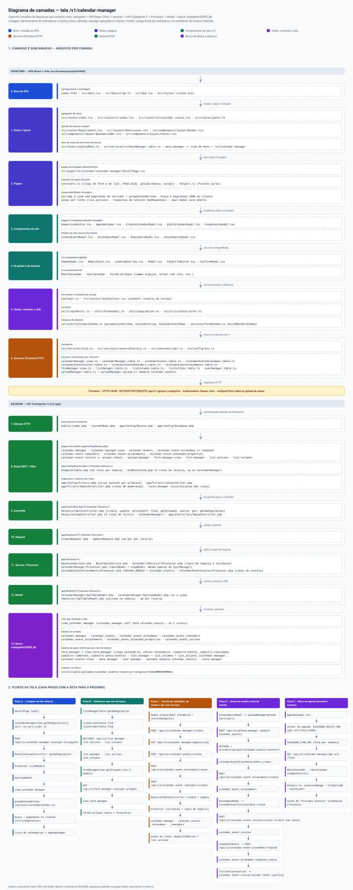

[◄ Índice da base de conhecimento](../../../README.md)

---

# Módulo `calendar` — espelho do Google Calendar

Primeiro módulo da pasta `markdown/geral/modulos/` — convenção nova: cada
módulo grande do sistema (calendário, depois `networking`, `map`,
`document_manager`) ganha sua própria pasta aqui, com um `README_<modulo>.md`
descrevendo o que existe e o que falta.

Backend já implementado e renomeado (era `Agenda`, virou `Calendar` — ver
histórico de commits): 6 tabelas/recursos — `calendar_manager`, `calendar_events`,
`calendar_event_attendees`, `calendar_event_reminders`,
`calendar_event_attachments`, `calendar_event_extended_properties` — com CRUD
REST completo (108 rotas, `Api\V1\Calendar\*` no backend). Frontend ainda no
começo.

## Diagrama de camadas da tela

Mapa visual do caminho completo da requisição que constrói a listagem
administrativa `/v1/calendar-manager` — do boot do SPA até a view
`view_calendar_manager`, com as camadas do backend e os cinco fluxos (listagem,
definições que vêm do banco, escrita, anexo/convite e agenda). O método e o
prompt para gerar os próximos diagramas ficam em
[`app/markdown/diagramas/README.md`](../../../../../../../app/markdown/diagramas/README.md).

*O preview reduz a imagem para a largura da janela — [abrir o SVG em tamanho real](../../../../../../../app/markdown/diagramas/README_diagrama_calendar_manager.svg).*

## ⚠️ Estado atual — só visualização, ainda NÃO existe um calendário construído

A página [`/v1/form/calendario`](http://localhost:54910/v1/form/calendario)
(arquivo
[`pages/v1/form/FormRendererPage.tsx`](../../../../pages/v1/form/FormRendererPage.tsx))
hoje mostra:

1. Um calendário do **mês atual** em largura total —
   [`components/ui/MonthCalendar`](../../../../components/ui/MonthCalendar/index.tsx).
2. Um calendário com os **12 meses do ano** abaixo —
   [`components/ui/YearCalendar`](../../../../components/ui/YearCalendar/index.tsx),
   que reaproveita o `MonthCalendar` em modo compacto (`size="sm"`).
3. Um botão que abre, dentro de um
   [`Modal`](../../../../components/global/Modal.tsx) centralizado, o
   formulário de cadastro de um calendário (`<FormGrid>` ligado a
   `POST /api/v1/calendar-manager/create`).

**Isso é só exibição.** `MonthCalendar`/`YearCalendar` calculam a grade a
partir de `Date`/`Intl` puro — **não leem nenhuma tabela do banco**. Nenhum
dia mostra evento, nenhum calendário real é selecionado; o dia atual é só
destacado visualmente. Criar um registro pelo modal grava em `calendar_manager`, mas
a tela não volta e não mostra esse calendário nem seus eventos — não há
vínculo nenhum entre o que é exibido e o que está no banco ainda.

## Listagem administrativa — `/v1/calendar-manager` (2026-09-20)

Rota própria (não é mais um redirect para `/v1/form/calendario` — decisão
revertida a pedido explícito do usuário: nenhum item de menu deve
redirecionar). Lista os calendários com seus eventos, uma linha por evento
agrupada por calendário — mesma ideia de `view_form_manager` +
`buildConstructorSchemas`, só que com 2 níveis (`calendar_manager` →
`calendar_events`) em vez de 4.

- **View** `view_calendar_manager` (migration
  `CreateViewCalendarManagerMigration`) — `calendar_manager` (`cm_`) `LEFT
  JOIN` `calendar_events` (`ce_`), filtrando `deleted_at IS NULL` dos dois
  lados. **Só 2 níveis de propósito**: os 4 ramos-filhos de `calendar_events`
  (`calendar_event_attendees/reminders/attachments/extended_properties`) NÃO
  entram nesta view — um `JOIN` simultâneo nos 4 geraria produto cartesiano
  (linhas repetidas multiplicadas). Ficam de fora, para consulta à parte
  quando existir tela de detalhe de evento.
- **Backend do módulo -view**: `Models/V1/Calendar/CalendarManager/SqlViewModel.php`,
  `Controllers/Api/V1/Calendar/CalendarManager/ResourceViewController.php`,
  `Config/Routes/Api/v1/Calendar/CalendarManager/EndPointView.php` (grupo
  `api/v1/calendar-manager-view`, 9 rotas, mesmo contrato do resto do
  projeto). O `Processor.php` do módulo (já existia, só de tabela) ganhou
  `$viewModel` ao lado do `$tableModel` já existente — mesmo padrão do
  `UserManager\Processor`.
- **Frontend**: `services/calendarSchema.ts` (`groupCalendarView`) agrupa as
  linhas achatadas por `cm_id`; `pages/v1/calendar/calendar-manager/GetAllPage.tsx`
  busca tudo via `getNoPagination` (sem paginação de servidor — a view pagina
  LINHA da view, não CALENDÁRIO) e faz busca + paginação **no cliente** sobre
  a lista já agrupada. O botão "Novo Calendário" reaproveita o mesmo
  `form_manager` de slug `calendario` já usado em `/v1/form/calendario`
  (mesmo `<FormGrid>`, mesmo `POST /api/v1/calendar-manager/create`) — não
  duplica formulário.
- **Débito conhecido**: paginação client-side é aceitável para poucos
  calendários/eventos; se o volume crescer, precisa de um redesenho de
  paginação de verdade sobre dados agrupados (fora de escopo por ora).

### Ordenação (2026-09-26)

- **Calendários**: nova coluna `calendar_manager.sort_order` (INT NOT NULL
  DEFAULT 0 — criada direto no banco DEV, sem migration, mesma regra de
  `README_migrate.md`; propagada para `view_calendar_manager` como
  `cm_sort_order`). `GetAllPage.tsx::load()` busca
  `getNoPagination({ sort: 'cm_sort_order', order: 'ASC' })` — menor valor
  aparece primeiro; todos nascem em `0`. Campo "Ordem" adicionado ao form
  `editar-calendario` (form_manager_id=18) em 2026-09-26 — grupo "Status"
  (`form_groups.id=39`), linha nova (`form_rows.id=128`), campo
  `field_id=215` (`field_name=sort_order`, `field_type=text`, `col=4`,
  `no_letters=1`, `no_special_chars=1`, `input_mode=numeric`,
  `default_value=0`). Inserido direto via SQL (`form_rows`/`form_fields`),
  autorizado explicitamente pelo usuário para este caso específico — a regra
  padrão continua sendo alterar dado de `form_manager` pela API, não por
  `INSERT` cru.
- **Eventos**: dentro de cada calendário, `group.events` é ordenado no
  cliente por `startDatetime`/`startDate` **decrescente** (mais recente/futuro
  primeiro, mais antigo por último) logo após `groupCalendarView(rows)` em
  `GetAllPage.tsx::load()` — afeta a tabela/cards do modal "Ver eventos"
  (`ViewEventsModal.tsx`, que antes não ordenava nada). Os cards de "Próximos
  eventos" (`AgendaViewer.tsx`) continuam com sua própria ordenação
  **crescente** (via `eventsInRange`, em `helpers.ts`) — é intencional: aquele
  bloco existe para navegar cronologicamente para frente (mês/ano, evento
  anterior/próximo) e depende dessa ordem.

## Lista simples — `/v1/calendar-list` (2026-09-26)

Segunda listagem, deliberadamente **sem nada além de busca + paginação
padrão** (sem eventos agrupados, sem ações, sem criar/editar) — pedido
explícito do usuário como "primeira parte" de uma tarefa maior. Consome
`calendar_manager` cru (não a view com eventos) via o motor do "Construtor de
Listas".

- **`list_manager`** novo, slug `calendar-list` (id `19`), `table_name` =
  `calendar_manager`, `api_get_endpoint` = `/api/v1/calendar-manager/get-all`,
  `api_search_endpoint` = `/api/v1/calendar-manager/search`, `default_sort` =
  `sort_order`/`asc`. **5 colunas** (`list_columns`, ids `73`–`77`): Nome
  (`summary`), Local (`location`), Fuso horário (`time_zone`), Status
  (`status`, format `status-badge`), Ordem (`sort_order`) — todas exceto
  Local são `sortable`. **Sem `list_actions`** (pedido explícito: "sem mais
  nada").
- **Frontend**: `pages/v1/calendar/calendar-list/GetAllPage.tsx` — fork
  simplificado de `pages/v1/user/user-profiles/GetAllPage.tsx` (mesmo motor
  `list_manager`/`list_columns`, paginação de servidor via `usePagination`),
  sem o filtro de status extra e sem coluna de ações. Rota
  `/v1/calendar-list` (`routes/v1/calendar.routes.tsx`, dentro do
  `<RequireAuth/>`, igual a `/v1/calendar-manager`).
- **Menu**: item "Lista de Calendários" (`menu_manager.id=27`), sob o mesmo
  pai "Calendário" (`parent_id=7`) do item "Admin Calendário" (`id=8`),
  `sort_order=2`.
- **Desvio de processo**: `list_manager`/`list_columns`/`menu_manager` foram
  inseridos **direto no banco** (não pela API, que exige `jwtauth` e esta
  sessão não tinha login) — autorizado explicitamente pelo usuário (mesmo
  precedente do campo "Ordem" do form `editar-calendario`, ver seção acima).

### Arrastar para reordenar (2026-09-26)

Coluna extra com ícone de grip (`bi-grip-vertical`), **fixa no componente**
`GetAllPage.tsx` — não é uma coluna de `list_columns`, decisão de arquitetura
deliberada: colocar isso no motor genérico do Construtor de Listas exigiria
inventar um tipo de coluna novo + convenção de endpoint de reordenação para
uma necessidade hoje exclusiva desta lista; quebraria a simplicidade do motor
para as outras ~10 listagens do projeto. Se outra lista precisar do mesmo no
futuro, generalizar então.

- **Só o ícone inicia o arrasto** (`draggable`) — o resto da linha só recebe
  o `drop`, nunca "pega" ao clicar em outro lugar.
- **Só funciona ordenado por "Ordem" crescente e sem busca ativa**
  (`canDrag`); fora disso o ícone fica visualmente inativo (opacidade
  reduzida, cursor `not-allowed`) com tooltip explicando o motivo. A página
  força esse sort como padrão no primeiro carregamento (sem `?sort=` na URL)
  porque o default global da app é `id`, não `sort_order`.
- **Ao soltar**: os calendários da **página exibida** (não a tabela inteira)
  são renumerados sequencialmente pela posição absoluta
  (`offset = (page-1)*limit`, `sort_order = offset + índice + 1`) e gravados
  via `PUT calendar-manager/update/{id}` **silencioso** — sem `LoadingOverlay`,
  sem recarregar a lista (atualização otimista local). Nenhum registro fora
  da página é tocado.

## Backend disponível (contrato já pronto para o frontend consumir)

| Recurso                            | Tabela                               | Endpoint-set REST (18 rotas cada)              |
| ---------------------------------- | ------------------------------------ | ---------------------------------------------- |
| Calendar Manager                   | `calendar_manager`                   | `/api/v1/calendar-manager/*`                   |
| Calendar Events                    | `calendar_events`                    | `/api/v1/calendar-events/*`                    |
| Calendar Event Attendees           | `calendar_event_attendees`           | `/api/v1/calendar-event-attendees/*`           |
| Calendar Event Reminders           | `calendar_event_reminders`           | `/api/v1/calendar-event-reminders/*`           |
| Calendar Event Attachments         | `calendar_event_attachments`         | `/api/v1/calendar-event-attachments/*`         |
| Calendar Event Extended Properties | `calendar_event_extended_properties` | `/api/v1/calendar-event-extended-properties/*` |

`calendar_events` tem FK para `calendar_manager` (`calendar_id`); os 4 últimos
recursos têm FK para `calendar_events`. Todo o endpoint-set segue o mesmo
contrato canônico do resto do projeto (`find`/`get`/`get-all`/`create`/
`update`/`delete-soft`/etc.) — ver `README_rotas_swagger.md` do backend.

## Convidados do evento — modal "Convidados" (2026-09-24)

- **Onde:** `/v1/calendar-manager` → "Ver eventos" → ação **Convidados** (ícone
  `people`, `list_actions` do list_manager `calendar-events-view`, tipo `modal`,
  `href_template='cadastro-convidado'`). O modal substitui o "Ver eventos";
  fechar volta a ele.
- **Lista:** `POST /api/v1/calendar-event-attendees/find` com
  `{ calendar_event_id }`; remover = `DELETE .../delete-soft/{id}`. Serviço
  `services/v1/calendarEventAttendees.table.ts`.
- **Formulário:** form_manager `cadastro-convidado` (FormGrid), `calendar_event_id`
  oculto e pré-preenchido. Select **Usuário** (`user_manager_id`, fonte
  `user-manager-view`) usa `fillFields` para preencher E-mail/Nome exibido.
- **`fillFields` (genérico do FormGrid):** `select_config_json.fillFields =
  { campo_destino: chave_do_item }` — ao escolher uma opção (select single),
  copia os valores para outros campos do mesmo `<form>`. Editável no Construtor
  de Formulários (`sel_fill_fields`, formato `destino:chave, destino:chave`).
- **Banco:** `calendar_event_attendees.user_manager_id` (obrigatório no create —
  sem convidado externo; e-mail/nome sempre do perfil) e `comment` TEXT. Arquivos
  `202609241300_alter_table.sql`, `202609241301_seed_table.sql` e
  `202609241400_alter_table.sql`.

## Lembretes do evento — modal "Lembretes" (2026-09-24)

- **Onde:** "Ver eventos" → ação **Lembretes** (ícone `bell`, `list_actions` de
  `calendar-events-view`, `href_template='cadastro-lembrete'`). Mesmo desenho do
  modal "Convidados": substitui o "Ver eventos" e volta a ele ao fechar.
- **Lista:** `POST /api/v1/calendar-event-reminders/find` com `{ calendar_event_id }`,
  ordenada por `minutes`; remover = `delete-soft`. Serviço
  `services/v1/calendarEventReminders.table.ts`. Um card por lembrete
  ("Notificação · 30 minutos antes"), igual em desktop e mobile.
- **Formulário:** `cadastro-lembrete` — Método (padrão Notificação) + Minutos
  antes (lista fixa 5/10/30 min, 1 h, 1 dia, 1 semana; padrão 30); Evento oculto.
- **Limite do MVP:** só grava a configuração — não existe agendador que dispare
  o aviso (nem por e-mail, nem por notificação). Destino natural: mensageria interna.

## Anexos do evento — modal "Anexos" (2026-09-24)

- **Onde:** "Ver eventos" → ação **Anexos** (ícone `paperclip`,
  `href_template='cadastro-anexo-evento'`). Mesmo desenho dos outros modais.
- **Envio (2 APIs, cada uma da sua tabela):** 1) `uploadManagerUpload.upload`
  (`module=calendar_events`, `reference_id=<evento>`) grava em
  `writable/uploads/calendar_events/<evento>/`; 2) `calendarEventAttachmentsTable`
  cria o anexo com `file_id`. Se (2) falhar, apaga o upload de (1).
- **Lista:** card por anexo com ícone pelo MIME, título, MIME · tamanho (tamanho vem
  de `upload-manager/find` por `module`/`reference_id`) e botões **Visualizar**
  (`uploadManagerUpload.serveUrl`, nova aba), **Baixar** (`downloadUrl`) e Remover
  (`delete-soft` do anexo **e** do upload: link responde 404, arquivo fica no disco;
  `delete-restore` reativa os dois; `delete-hard`/`clear-deleted` apagam o arquivo).
- **Segurança pendente:** `serve`/`download` não exigem login (aguarda sessão).

## Roadmap — próximos passos

1. **Criar o primeiro calendário de verdade**, pelo modal já existente em
   `/v1/form/calendario` — vira o `calendar_id` de referência para testar o
   resto.
2. **Clonar a tela atual para uma tela de calendário real**, ligada a um
   `calendar_id` (ex.: `pages/v1/calendar/calendar-manager/ViewPage.tsx`, rota tipo
   `/v1/calendar/:calendarId`). Mesmos componentes `MonthCalendar`/
   `YearCalendar`, mas agora recebendo a lista de `calendar_events` daquele
   calendário (`GET /api/v1/calendar-events/get-all?calendar_id=...` ou
   `find`) e **marcando no grid os dias que têm evento** (precisa de uma prop
   nova nos dois componentes — algo como `eventsByDay` — para pintar/contar
   eventos por dia sem virar outro componente).
3. **CRUD de evento a partir do dia clicado**: clicar num dia do calendário
   real abre modal de criar/editar `calendar_events` (mesmo padrão `Modal` +
   `FormGrid` já usado para `calendar_manager`).
4. **Sub-recursos do evento** (attendees, reminders, attachments, extended
   properties) — cada um com a **própria API** (nada via `calendar-events` nem
   via `view_calendar_manager`). **Convidados, Lembretes e Anexos: feitos
   (2026-09-24)** — ver seções abaixo. Extended properties: pendente.
5. **Lista de calendários**: quando existir mais de 1 `calendar`, uma tela
   `pages/v1/calendar/calendar-manager/GetAllPage.tsx` (padrão `list_manager` já
   usado no resto do projeto) para escolher qual visualizar/editar.
6. Trocar o botão/label hardcoded de "Preencher formulário" — hoje a página é
   genérica por slug; quando o calendário virar tela própria (passo 2), essa
   genericidade deixa de ser necessária para este caso.

## Convenção de nomenclatura

Mesma regra do resto do projeto (ver
[`README_paginas_modulo.md`](../../README_paginas_modulo.md)): pasta/arquivo/
rota/identificador **sempre em inglês** (`Calendar`, `CalendarEvent...`);
texto exibido na tela e comentários **em português** (`Calendário`, `Ano
completo`). Nunca usar "Google" fora de comentário/descrição — é só
inspiração de modelo de dados, não branding do produto.

## Próximos módulos planejados (contexto, fora do escopo deste README)

Registrado aqui só para situar por que a pasta `modulos/` existe — cada um
ganha o próprio `README_<modulo>.md` quando entrar em desenvolvimento:

- **`networking`** — mensagens: lista pública, mensagem privada, mensagens em
  grupo.
- **`map`** — mapas (SVG + Google Maps): pontos, rotas, distância.
- **`document_manager`** (SGD — Sistema Gerencial de Documentos, futuro mais
  distante) — lotes de documentos, arquivamento com locais físicos, formulário
  que cadastra qualquer documento (virtual ou anexo de físico), desarquivamento,
  compartilhamento por link temporário, autenticação por link + QRCode + UUID.

## Arquivos

- [`components/ui/MonthCalendar/index.tsx`](../../../../components/ui/MonthCalendar/index.tsx)
- [`components/ui/YearCalendar/index.tsx`](../../../../components/ui/YearCalendar/index.tsx)
- [`components/global/Modal.tsx`](../../../../components/global/Modal.tsx)
- [`pages/v1/form/FormRendererPage.tsx`](../../../../pages/v1/form/FormRendererPage.tsx)
- Backend: `src/app/Controllers/Api/V1/Calendar/*`, `src/app/Services/V1/Calendar/*`,
  `src/app/Models/V1/Calendar/*`, `src/app/Config/Routes/Api/v1/Calendar/*`.

---

[◄ Índice da base de conhecimento](../../../README.md)

---

### 📌 Metadados do Autor

| Campo | Informação |
| --- | --- |
| **Nome** | Gustavo Hammes |
| **Local** | Rio de Janeiro |
| **LinkedIn** | [linkedin.com/in/gustavo-hammes](https://www.linkedin.com/in/gustavo-hammes) |
| **Stack principal** | PHP (Laravel, Symfony, Cake, Codeigniter), Java Spring Boot, JS/TS (React, Angular, Node.js), Mobile (React Native, Flutter) |
